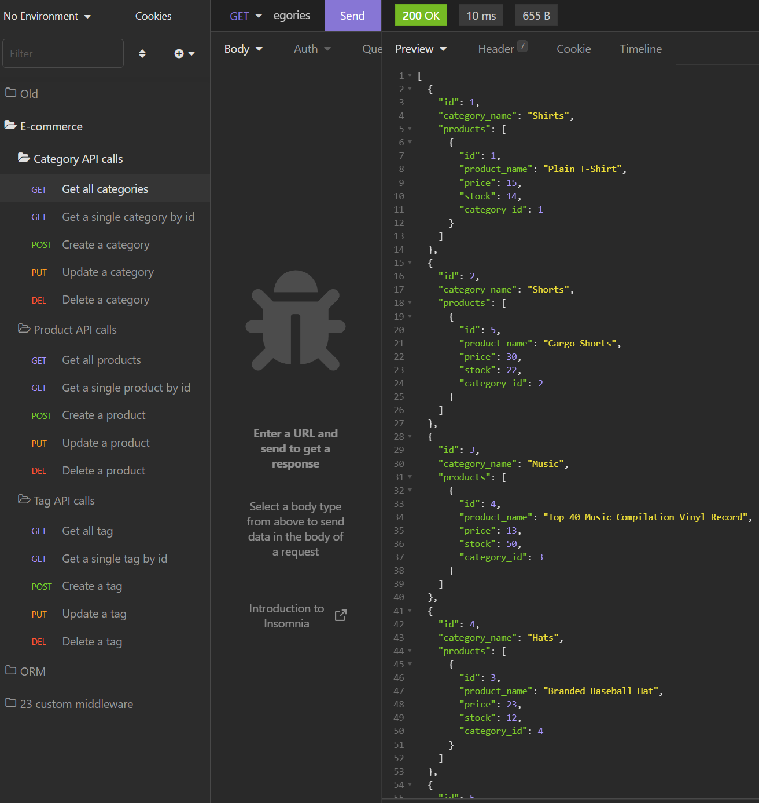
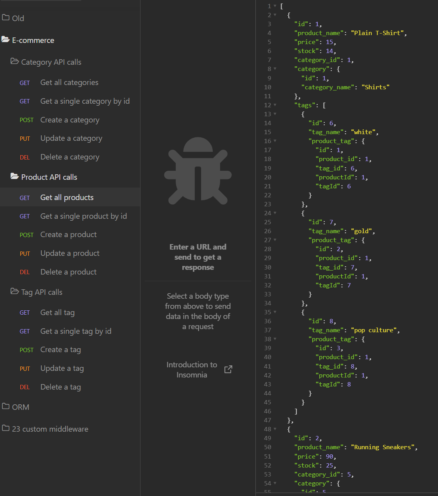
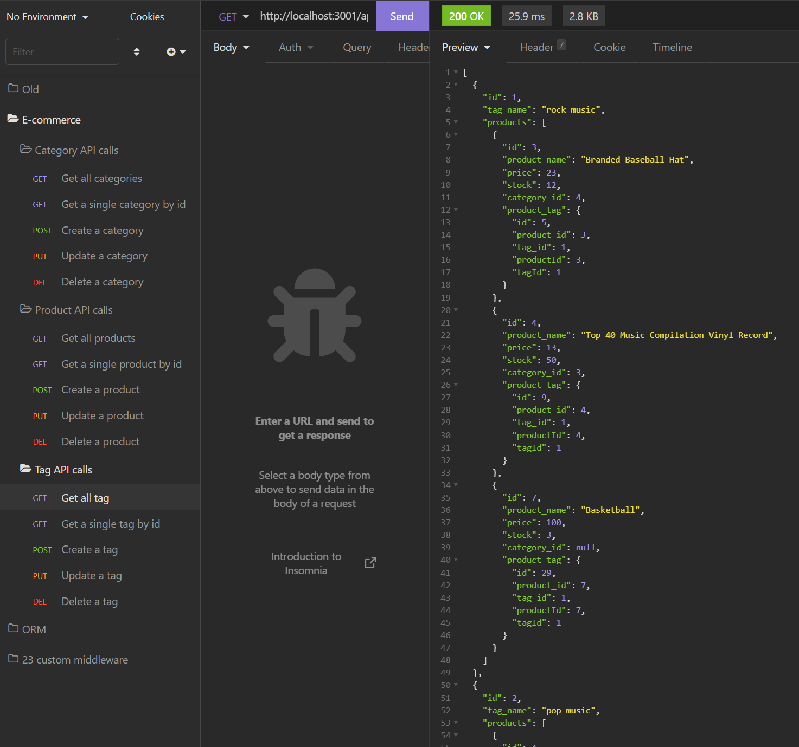

# 13 Object-Relational Mapping (ORM) Challenge: E-Commerce Back End

[Video of program walkthrough]()

## Table of Contents
- [Description](#description)
- [Visuals](#visuals)
- [Usage](#usage)

## Description
This is the solution JavaScript for the 02-Challenge assignment in the 13 ORM Module.

The purpose of the assignment was to augment the project starter code with completed Category, Product, ProductTag, and Tag models, along with the appropriate route code for the API routes to support CRUD operations through the service (against the ORM).  This is an *Express.js* service, using *Sequelize*, with *mysql2* accessing the back-end MySQL database.

This project achieves all of the stated project requirements.

## Usage 
This program has has dependencies, and requires their installation via *npm*.  This service can be invoked via Node at the command prompt using *npm start*, or with *Nodemon*.

## Installation Instructions
The program requires *npm* installation of the express, sequelize, and mysql2 modules (and their dependencies).  Mysql needs to be installed on the machine, with the server set up to accept login from user *root* with a *blank password*.  If that is not compatible with your configuration, you can change line 7 in *config/connection.js* to reflect the actual authentication credentials.  The SQL script *./db/schema.sql* needs to be run in Mysql prior to starting this project.  Optional seed data can be populated by running *node seeds/index.js* or *npm run seed*.

## Visuals
### The program in operation
[Video of program walkthrough]()

